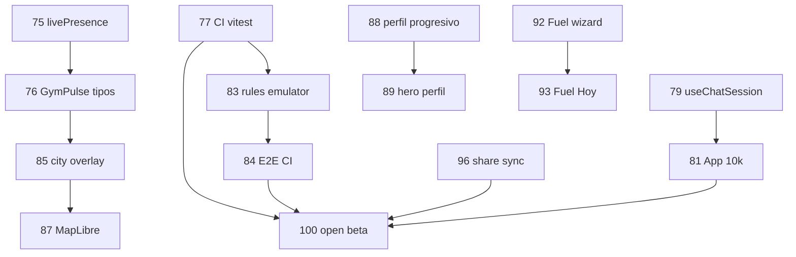

# Gestión de fases 1–100 — EntrenaMatch (documento maestro v2)

**Versión actual en producción:** `0.1.281` (versionCode 281)  
**Meta cierre fase 100:** open beta v1 — informe + métricas Play internal  
**Deploy web:** https://entrenamatch.web.app · https://musclegrenadechile.github.io/entrenamatch/  
**Informe de cierre:** `OPEN_BETA_INFORME.md` (jun 2026)  
**Última actualización:** 9 junio 2026

Este documento **unifica** los roadmaps anteriores (`ROADMAP_30/40`, `111–160`, `PLAN_POLISH 161–260`, oleadas Entreno de Hoy) en **una sola numeración 1–100** para planificar, commitear y desplegar.

---

## Leyenda

| Símbolo | Significado |
|---------|-------------|
| ✅ | Completado y verificado en `main` |
| 🔄 | Parcial — falta cerrar DoD |
| ⏳ | Pendiente (roadmap activo) |
| **P0–P3** | Prioridad (P0 = bloquea beta/Play) |

---

## Convenciones operativas

### Versión por fase (fases 75–100)

```
Fase N  →  0.1.(254 + (N - 74))
Ejemplo: Fase 75 → 0.1.255 · Fase 100 → 0.1.280
```

Archivos a bump siempre juntos: `package.json`, `src/constants/index.ts`, `android/app/build.gradle`.

### Definition of Done (DoD)

Una fase está ✅ solo si:

1. Entregable visible en UI o API documentada  
2. `npm test` verde  
3. `npm run build` verde  
4. Deploy web (push `main` → GitHub Pages) si aplica  
5. Esta fila marcada ✅ con versión en la columna **Versión**

### Comandos habituales

```powershell
npm test
npm run build -- --base=/entrenamatch/
# Play (cuando la fase lo indique)
.\publish-play.bat internal
```

---

## Resumen ejecutivo

```
Fases  1–74   ✅ Legado cerrado (MVP → open beta v1 → GymPulse → Entreno de Hoy oleadas 4–7)
Fases 75–84   ✅ Oleada A — Confianza técnica (CI, mapa, hooks App)
Fases 85–91   ✅ Oleada B — Mapa hero + Perfil humano
Fases 92–95   ✅ Oleada C — Fuel + EntrenoLog
Fases 96–99   ✅ Oleada D — Social viral + red
Fase  100     🔄 Open beta v1 — informe ✅; métricas Play/sync pendientes
```

---

# PARTE A — Fases 1–74 ✅ (legado implementado)

> No reimplementar. Referencia histórica por bloques. Detalle en docs antiguos si hace falta auditar.

| Bloque | Fases | Contenido | Versión ref. |
|--------|-------|-----------|--------------|
| **A1** | 1–10 | MVP: swipe, perfiles seed, chat demo, sesiones, squads, Fuel stub | v0.1.100 |
| **A2** | 11–20 | Firebase Auth real, Firestore chat/matches, reglas, multi-device | v0.1.120 |
| **A3** | 21–30 | GymPulse mapa v1, live toggle, explore deck, onboarding legal | v0.1.160 |
| **A4** | 31–40 | Open beta polish: skeletons, nav 5 tabs, Hoy/Muro, tour mapa | v0.1.170 |
| **A5** | 41–50 | Activación: first live, sync blocker, geo, weekly pact wizard, city challenge | v0.1.180 |
| **A6** | 51–60 | Chat polish, voice streak, match score, Fuel×coach, dispatch ETA stub | v0.1.190 |
| **A7** | 61–70 | Lazy tabs, sync extract, E2E Playwright, error boundaries, referral, ASO stub | v0.1.200 |
| **A8** | 71–74 | FuelBalance/constancia/partner, GymPulse pipeline (clusters, ghost, Cerca), hooks App, Entreno de Hoy oleadas 4–7, feed ranking, chat v2, meta semanal | **v0.1.254** |

### Entregables A8 ya en código (v0.1.254)

| Tema | Qué hay |
|------|---------|
| Refactor | `useLiveMapPipeline`, `useFuelState`, `useSyncSession`, `FullProfileSheet`, `useDailyPulse`, `feedRanking.ts` |
| Mapa | Tab GymPulse, botón **Cerca** (2 km), ghost mode, sin seeds prod |
| Entreno de Hoy | Hero card, rutinas gym Firestore, compare pacto, copiar último entreno, Fuel toast |
| Social | Feed ranking (bond+live+recencia+proximidad), chat dock Sync/Voz/Log/Propuesta |
| Retención | Meta de la semana (sheet modal), pact reminder, post-live share |
| Sync | `SyncLiveBlockerModal` bottom sheet (fix visual) |

### Deuda explícita heredada (pasa a fases 75+)

- `App.tsx` ~**12.400** líneas (meta <8k)  
- `@ts-nocheck` en `App.tsx` y `GymPulseMap.tsx`  
- `livePresence` vs `profiles.trainingNow` — doble fuente  
- CI vitest en PR — no obligatorio  
- MP producción, MapLibre, tiles offline — no hecho  

---

# PARTE B — Fases 75–100 ⏳ (roadmap activo)

## Oleada A — Confianza técnica (75–84) · P0

*Sin esto, cada feature nueva es más lenta y frágil.*

| Fase | Versión | Entregable | P | Depende | Estado |
|------|---------|------------|---|---------|--------|
| **75** | 0.1.255 | **`livePresence` fuente primaria** — `resolveLiveMapMerge` + tests; profiles solo fallback | P0 | A8 | ✅ v0.1.264 |
| **76** | 0.1.256 | **GymPulseMap tipos estrictos** — quitar `@ts-nocheck`; popups tipados | P0 | 75 | 🔄 props tipados; @ts-nocheck pendiente |
| **77** | 0.1.257 | **CI: vitest en PR** — `.github/workflows/ci.yml` | P0 | — | ✅ v0.1.264 |
| **78** | 0.1.258 | **Vitest mapa** — `gymPulseLive.test.ts`, `gymPulseCluster.test.ts` | P1 | 76 | ✅ v0.1.264 |
| **79** | 0.1.259 | **Hook `useChatSession`** — chat/matches/listeners fuera de App | P0 | — | ✅ v0.1.264 |
| **80** | 0.1.260 | **Hook `useFeedState`** — feed filters + `loadGlobalFeed` | P1 | — | ✅ v0.1.264 |
| **81** | 0.1.261 | **App.tsx < 10k líneas** — ~12.9k → siguiente extracción | P0 | 79–80 | 🔄 −327 LOC |
| **82** | 0.1.262 | **Bundle budget CI** — `scripts/check-bundle-size.mjs` App chunk | P2 | 81 | ✅ v0.1.264 |
| **83** | 0.1.263 | **Firestore rules contract tests** — livePresence, posts, messages | P0 | 77 | ✅ v0.1.264 |
| **84** | 0.1.264 | **E2E smoke en CI** — Playwright `e2e/smoke.spec.ts` | P0 | 77, 83 | ✅ v0.1.264 |

**Done oleada A:** CI verde en PR; mapa tipado; App ~10k; livePresence única.

---

## Oleada B — Mapa hero + Perfil (85–91) · P1

*Lo que el usuario ve y comparte.*

| Fase | Versión | Entregable | P | Depende | Estado |
|------|---------|------------|---|---------|--------|
| **85** | 0.1.265 | **City challenge overlay** — polígono hex + CTA LIVE en mapa | P1 | 76 | ✅ v0.1.271 |
| **86** | 0.1.266 | **QR / deep link check-in** — `?gym=id` → check-in automático | P1 | A8 | ✅ v0.1.271 |
| **87** | 0.1.267 | **MapLibre GL vector dark** — opt-in `VITE_MAP_USE_MAPLIBRE=1` | P1 | 85 | ✅ v0.1.271 |
| **88** | 0.1.268 | **Perfil progresivo** — secciones avanzadas colapsadas 7 días | P1 | — | ✅ v0.1.271 |
| **89** | 0.1.269 | **Hero perfil** — `ProfileHeroPulse` LIVE + ghost + streak | P1 | 88 | ✅ v0.1.271 |
| **90** | 0.1.270 | **Perfil sin ruido** — Tienda/Coach/Admin bajo colapsables | P1 | 88 | ✅ v0.1.271 |
| **91** | 0.1.271 | **Map view cache** — última bbox/zoom en localStorage offline | P2 | 87 | ✅ v0.1.271 |

**Done oleada B:** mapa “app 2026”; perfil entendible en 10 s.

---

## Oleada C — Fuel + EntrenoLog (92–95) · P1

*Cierra el loop entrenar → registrar → nutrir.*

| Fase | Versión | Entregable | P | Depende | Estado |
|------|---------|------------|---|---------|--------|
| **92** | 0.1.272 | **Fuel setup wizard ≤3 preguntas** — resto defaults inteligentes | P1 | A8 | ✅ v0.1.275 |
| **93** | 0.1.273 | **Fuel card siempre en Hoy** — estado “configura en 1 min” si falta perfil | P1 | 92 | ✅ v0.1.275 |
| **94** | 0.1.274 | **Gráfico semanal** burn vs consumo vs target (FuelDayCard) | P1 | 122 | ✅ v0.1.275 |
| **95** | 0.1.275 | **PRs por ejercicio** — records locales + sync Firestore ligero | P2 | oleada 4–5 | ✅ v0.1.275 |

**Done oleada C:** Fuel onboarding 1 min; balance semanal visible; PRs persisten.

---

## Oleada D — Social viral + red (96–99) · P1–P2

*Por qué volver mañana (no solo WhatsApp).*

| Fase | Versión | Entregable | P | Depende | Estado |
|------|---------|------------|---|---------|--------|
| **96** | 0.1.276 | **Share card post-sync** — imagen 1080×1920 + publicar muro 1-tap | P1 | A8 | ✅ v0.1.279 |
| **97** | 0.1.277 | **Deep links notificaciones** — tap → chat / sesión / mapa / perfil | P1 | 86 | ✅ v0.1.279 |
| **98** | 0.1.278 | **Chat: read receipts + typing** — polish sobre GymPartner v2 | P2 | 79 | ✅ v0.1.279 |
| **99** | 0.1.279 | **Training Network grafo** — alianzas sync visuales en perfil | P2 | A6 parcial | ✅ v0.1.279 |

**Done oleada D:** share post-sync viral; deep links; chat polish; grafo RED visible.

---

## Fase 100 — Cierre open beta (100) · P0

| Fase | Versión | Entregable | P | Depende | Estado |
|------|---------|------------|---|---------|--------|
| **100** | **0.1.281** | **Open beta v1** — informe cierre fases 75–99; Crashlytics APK; Play internal track; criterios D1/D7/crash-free; deploy GH+Firebase | P0 | 77, 84, 96 | 🔄 |

### Criterios de salida fase 100

- [ ] Crash-free sessions > **99%** (7 días Play internal) — AAB 281 en track `internal` ✅ (9 jun 2026)  
- [ ] ≥ **1 sync real** entre 2 usuarios distintos por semana en Viña **o** Santiago (piloto)  
- [x] CI: vitest + E2E smoke + rules emulator en verde  
- [ ] `App.tsx` **< 8.000** líneas (actual: **~13.059**)  
- [x] Documento `OPEN_BETA_INFORME.md` con métricas y próximos 20 pasos post-100  

> Detalle completo: **`OPEN_BETA_INFORME.md`** · Fixes recientes: v0.1.280 (crash sync), v0.1.281 (filtro ejercicios Arena).

---

## Orden de ataque recomendado (próximas 6 fases)

Si solo puedes avanzar **una oleada corta** ahora:

| Orden | Fase | Por qué primero |
|-------|------|-----------------|
| 1 | **77** | CI vitest — evita regresiones como `SyncLiveBlockerModal` |
| 2 | **75** | Mapa/live consistente — base de todo el producto |
| 3 | **79** | Refactor chat — App.tsx deja de crecer |
| 4 | **88–90** | Perfil humano — primera impresión post-login |
| 5 | **85** | City overlay — mapa con “juego” visible |
| 6 | **96** | Share post-sync — loop viral local |

---

## Mapa de dependencias (fases 75–100)



---

## Relación con documentos anteriores

| Documento | Uso a partir de ahora |
|-----------|------------------------|
| **`GESTION_FASES_1_100.md`** | **Planificación activa** — fases 75–100 |
| `ORDEN_ATAQUE_111_160.md` | Referencia histórica; no ampliar |
| `PLAN_POLISH_100_FASES.md` (161–260) | Contenido **absorbido** en fases 75–100 |
| `ROADMAP_FASES_111_160.md` | Detalle técnico mapa/pagos; consulta puntual |
| `SISTEMA_IMPLEMENTACION_FASES.md` | DoD y comandos — **actualizar convención versión** a fases 75+ |

---

## Post fase 100 (backlog, no numerado)

| Tema | Entregable |
|------|------------|
| Pagos | Mercado Pago producción + checkout marketplace + fee split |
| Coach | PT onboarding self-service + pin mapa “en camino” |
| IA | Icebreakers / coach LLM (fuera de scope oleada 7) |
| Escala | MapLibre offline avanzado, multi-ciudad LATAM |

---

## Próxima acción

1. **Fase 100 ops:** Monitorear Crashlytics 7 días + testers internal (ver `PLAY_INTERNAL_v0.1.281.md`)  
2. **Piloto:** Viña + Santiago — medir syncs reales/semana  
3. **Fases 🔄:** 76 (quitar `@ts-nocheck` GymPulseMap) · 81 (extraer Arena de App.tsx)  
4. **Post-100 P0:** Derby Viña vs Santiago (UI duelo sobre `cityWeeklyStats`)  

---

*Documento maestro v2 — jun 2026. Sustituye la planificación dispersa 111–160 / 161–260 para el tramo hasta open beta.*
