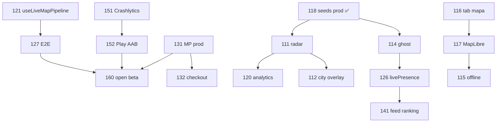

# Orden de ataque completo — Fases 111 → 160

**Versión actual:** v0.1.247 · **Meta cierre fase 160:** v0.1.280  
**Deploy:** https://entrenamatch.web.app  
**Roadmap detalle:** `ROADMAP_FASES_111_160.md`

Este documento define la **secuencia de ejecución real** (no el orden numérico 111→160).  
Cada fila = 1 entregable verificable (commit + deploy o test verde).

```powershell
# Versión por fase (111–160)
node scripts/bump-version-phase.mjs 120

npm run build -- --base=/
npm run deploy
```

---

## Leyenda de estado

| Símbolo | Significado |
|---------|-------------|
| ✅ | Completado y desplegado |
| 🔄 | En progreso |
| ⏳ | Pendiente (siguiente oleada) |
| 🔒 | Bloqueado por dependencia |

---

## Oleada 0 — Percepción mapa (P0) · Semana 1

| # | Fase | Versión | Entregable | Estado | Depende de |
|---|------|---------|------------|--------|------------|
| 1 | **118** | 0.1.234 | Quitar partners seed demo en prod (`partnersForMap`) | ✅ | — |
| 2 | **114** | 0.1.235 | Ghost mode — coords fuzzy ~500 m + toggle Perfil | ✅ | 118 |
| 3 | **126** | 0.1.236 | `livePresence` fuente primaria documentada + fallback profiles | ⏳ | 114 |
| 4 | **128** | 0.1.237 | Quitar `@ts-nocheck` GymPulseMap + tipos popups | ⏳ | 106–110 |

**Done cuando:** mapa sin pins fantasma, privacidad ghost activa, tipos mapa estrictos.

---

## Oleada 1 — GymPulse Bloque C (P1) · Semana 2

| # | Fase | Versión | Entregable | Estado | Depende de |
|---|------|---------|------------|--------|------------|
| 5 | **111** | 0.1.235 | Radar mode — sweep 3 s + pill “X en 2 km” | ✅ | 118 |
| 6 | **112** | 0.1.239 | City challenge overlay — polígono zona + CTA en mapa | ⏳ | 111 |
| 7 | **120** | 0.1.235 | Métricas mapa — `map_open`, `cluster_expand`, `partner_checkin` | ✅ | 111 |
| 8 | **119** | 0.1.241 | QR check-in partner — deep link `?gym=id` | ⏳ | 118 |

**Done cuando:** radar usable, reto ciudad visible en mapa, analytics mapa en Firebase.

---

## Oleada 2 — Refactor App.tsx (P0) · Semana 3

| # | Fase | Versión | Entregable | Estado | Depende de |
|---|------|---------|------------|--------|------------|
| 9 | **121** | 0.1.247 | Hook `useLiveMapPipeline` (filters, mapForceTick, debounce) | ✅ | 128 |
| 10 | **122** | 0.1.247 | Hook `useFuelState` + refreshFuelData | ✅ | — |
| 11 | **123** | 0.1.247 | Hook `useSyncSession` (Arena, bonds, trainingSyncWith) | ✅ | — |
| 12 | **124** | 0.1.247 | Partner dev CRUD → `usePartnerLocations` (hook listo) | ✅ | 118 |
| 13 | **125** | 0.1.248 | App.tsx < 8k líneas + LazyTabs sin imports rotos | 🔄 | 121–124 |
| 14 | **127** | 0.1.247 | E2E Playwright: login → live → mapa → sync → Fuel | ✅ | 121–123 |

**Done cuando:** App.tsx no contiene `filterMapLiveUsers` inline; E2E verde.

---

## Oleada 3 — Confianza y tests (P0–P1) · Semana 3–4

| # | Fase | Versión | Entregable | Estado | Depende de |
|---|------|---------|------------|--------|------------|
| 15 | **129** | 0.1.248 | Vitest — marker diff, cluster, filterMapLiveUsers | ⏳ | 110, 121 |
| 16 | **130** | 0.1.249 | Lighthouse CI — budget bundle App + map lazy | ⏳ | 125 |

---

## Oleada 4 — EntrenaCoach + pagos (P0) · Semana 4

| # | Fase | Versión | Entregable | Estado | Depende de |
|---|------|---------|------------|--------|------------|
| 17 | **131** | 0.1.250 | MP producción — `APP_USR` + webhook prod | ⏳ | — |
| 18 | **132** | 0.1.251 | Checkout marketplace — fee 15%, payout PT pending | ⏳ | 131 |
| 19 | **134** | 0.1.252 | Onboarding PT self-service — form + video + pending | ⏳ | 131 |
| 20 | **133** | 0.1.253 | Admin liquidaciones — marcar pagado + CSV | ⏳ | 132 |
| 21 | **135** | 0.1.254 | PT pin en mapa — icono + popup reserva | ⏳ | 134, 111 |

---

## Oleada 5 — Mapa hero producto (P1) · Semana 5

| # | Fase | Versión | Entregable | Estado | Depende de |
|---|------|---------|------------|--------|------------|
| 22 | **116** | 0.1.255 | Tab “Mapa” dedicado en nav (map-first) | ⏳ | 111–112 |
| 23 | **117** | 0.1.256 | MapLibre GL vector dark — sustituir raster Carto | ⏳ | 116 |
| 24 | **113** | 0.1.257 | PT dispatch pin — interp ruta + ETA pill | ⏳ | 135 |
| 25 | **115** | 0.1.258 | Tiles offline — cache bbox IndexedDB | ⏳ | 117 |

---

## Oleada 6 — FuelBalance + EntrenaLog (P1) · Semana 5–6

| # | Fase | Versión | Entregable | Estado | Depende de |
|---|------|---------|------------|--------|------------|
| 26 | **136** | 0.1.259 | Gráfico semanal burn vs consumo (FuelDayCard) | ⏳ | 122 |
| 27 | **137** | 0.1.260 | Copiar último entreno one-tap EntrenaLog | ⏳ | — |
| 28 | **140** | 0.1.261 | Post-EntrenaLog → Fuel toast kcal estimadas | ⏳ | 136 |
| 29 | **138** | 0.1.262 | PRs / records por ejercicio | ⏳ | 137 |
| 30 | **139** | 0.1.263 | Health Connect / Apple Health stub → real | ⏳ | 136 |

---

## Oleada 7 — Social graph (P1–P2) · Semana 7

| # | Fase | Versión | Entregable | Estado | Depende de |
|---|------|---------|------------|--------|------------|
| 31 | **141** | 0.1.264 | Feed ranking — proximidad + live + bond | ⏳ | 126 |
| 32 | **143** | 0.1.265 | Deep links notificaciones → chat/sesión/mapa | ⏳ | 116 |
| 33 | **142** | 0.1.266 | Share card post-sync — imagen OG + muro | ⏳ | 123 |
| 34 | **144** | 0.1.267 | Chat polish — read receipts + typing + icebreaker mapa | ⏳ | 143 |
| 35 | **145** | 0.1.268 | Training Network grafo visual en perfil | ⏳ | 123 |

---

## Oleada 8 — Partners B2B + Marketplace (P1–P2) · Semana 8

| # | Fase | Versión | Entregable | Estado | Depende de |
|---|------|---------|------------|--------|------------|
| 36 | **147** | 0.1.269 | Partner dashboard in-app — live count + check-ins | ⏳ | 119 |
| 37 | **148** | 0.1.270 | Marketplace catálogo 5–10 productos reales | ⏳ | 132 |
| 38 | **149** | 0.1.271 | Inventario + stock post-orden MP | ⏳ | 148 |
| 39 | **150** | 0.1.272 | Comisión partner mapa — CTA promo + UTM | ⏳ | 147 |
| 40 | **146** | 0.1.273 | Portal partner gym web — stats + promos | ⏳ | 147 |

---

## Oleada 9 — Mobile + Play (P0) · Semana 9

| # | Fase | Versión | Entregable | Estado | Depende de |
|---|------|---------|------------|--------|------------|
| 41 | **151** | 0.1.274 | Firebase Crashlytics native + JS | ⏳ | — |
| 42 | **152** | 0.1.275 | AAB Play Closed + testers S26 matrix | ⏳ | 151 |
| 43 | **153** | 0.1.276 | Capacitor sync — base `/` + offline tiles 115 | ⏳ | 115, 152 |
| 44 | **154** | 0.1.277 | Push deep link → tab mapa `?map=1` | ⏳ | 116, 143 |
| 45 | **155** | 0.1.278 | ASO — screenshots mapa 2.0 + What's new | ⏳ | 152 |

---

## Oleada 10 — Escala + cierre beta (P2–P3) · Semana 10–12

| # | Fase | Versión | Entregable | Estado | Depende de |
|---|------|---------|------------|--------|------------|
| 46 | **156** | 0.1.279 | MapEngine abstraction — Leaflet → MapLibre migratable | ⏳ | 117 |
| 47 | **159** | 0.1.280 | Firestore indexes audit — livePresence, checkIns, orders | ⏳ | 126, 148 |
| 48 | **158** | 0.1.281 | Cloud Functions v2 — cold start + secrets MP | ⏳ | 131 |
| 49 | **157** | 0.1.282 | i18n EN — mapa + onboarding + landing | ⏳ | 125 |
| 50 | **160** | 0.1.283 | Open beta v1 — informe cierre 111–160 + deploy GH+Firebase | ⏳ | 151–159 |

> **Nota versión:** meta comercial fase 160 = **v0.1.280** (informe + indexes). Fases 157–160 pueden extender patch post-beta.

---

## Diagrama de dependencias críticas



---

## Checklist por fase (referencia rápida 111–160)

| Fase | Bloque | P | Entregable one-liner |
|------|--------|---|----------------------|
| 111 | D | P1 | Radar sweep + pill 2 km |
| 112 | D | P1 | City challenge polígono mapa |
| 113 | D | P2 | PT dispatch pin + ETA |
| 114 | D | P0 | Ghost mode fuzzy 500 m |
| 115 | D | P2 | Tiles offline IndexedDB |
| 116 | E | P1 | Tab Mapa nav dedicado |
| 117 | E | P1 | MapLibre GL vector dark |
| 118 | E | P0 | Sin seeds demo en prod ✅ |
| 119 | E | P1 | QR / deep link check-in gym |
| 120 | E | P2 | Analytics eventos mapa |
| 121 | F | P0 | useLiveMapPipeline hook |
| 122 | F | P0 | useFuelState hook |
| 123 | F | P0 | useSyncSession hook |
| 124 | F | P1 | usePartnerLocations hook |
| 125 | F | P1 | App.tsx < 8k líneas |
| 126 | G | P0 | livePresence primaria |
| 127 | G | P0 | E2E Playwright flujo core |
| 128 | G | P1 | GymPulseMap tipos estrictos |
| 129 | G | P1 | Vitest mapa regresión |
| 130 | G | P2 | Lighthouse CI budgets |
| 131 | H | P0 | Mercado Pago producción |
| 132 | H | P0 | Checkout marketplace fee |
| 133 | H | P1 | Admin liquidaciones CSV |
| 134 | H | P0 | Onboarding PT self-service |
| 135 | H | P1 | PT pin mapa reserva |
| 136 | I | P1 | Fuel gráfico semanal |
| 137 | I | P1 | Copiar último entreno |
| 138 | I | P2 | PRs por ejercicio |
| 139 | I | P2 | Health Connect / Apple Health |
| 140 | I | P1 | EntrenaLog → Fuel toast |
| 141 | J | P1 | Feed ranking social |
| 142 | J | P2 | Share card post-sync |
| 143 | J | P1 | Deep links notificaciones |
| 144 | J | P2 | Chat read/typing/icebreaker |
| 145 | J | P2 | Training Network grafo |
| 146 | K | P2 | Portal partner web |
| 147 | K | P1 | Partner dashboard in-app |
| 148 | K | P1 | Marketplace catálogo real |
| 149 | K | P2 | Inventario stock MP |
| 150 | K | P2 | Comisión partner UTM |
| 151 | L | P0 | Crashlytics |
| 152 | L | P0 | AAB Play Closed |
| 153 | L | P1 | Capacitor sync offline |
| 154 | L | P1 | Push → mapa deep link |
| 155 | L | P2 | ASO screenshots |
| 156 | M | P2 | MapEngine abstraction |
| 157 | M | P3 | i18n EN |
| 158 | M | P2 | Cloud Functions v2 |
| 159 | M | P2 | Firestore indexes audit |
| 160 | M | P1 | Open beta + informe cierre |

---

## Próxima acción (ahora)

1. ✅ **118** — seeds demo fuera del mapa prod  
2. ✅ **114** — ghost mode en Perfil + livePresence  
3. ✅ **111** — radar + pill 2 km  
4. ✅ **120** — eventos analytics mapa  
5. ⏳ **126** — consolidar livePresence como fuente única (doc en useLiveMapPipeline)
6. ⏳ **112** — city challenge overlay en mapa
7. ⏳ **124–125** — wire usePartnerLocations + reducir App.tsx < 8k  

---

*Actualizado v0.1.234 — orden de ataque optimizado por P0 → P1 → P2, no orden numérico.*
