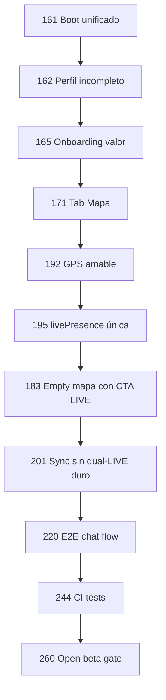

# EntrenaMatch — Plan de pulido 100 fases (161 → 260)

**Perspectiva:** usuario real que abre la app por primera vez en Chile (móvil web o APK), sin contexto previo.  
**Continúa desde:** fases 111–160 (`ROADMAP_FASES_111_160.md`) + trabajo reciente 124–125.  
**Meta:** que en **≤3 minutos** entienda qué es, haga **1 acción valiosa** (swipe, live o post) y quiera volver mañana.

**Leyenda de prioridad**

| Tag | Significado |
|-----|-------------|
| **P0** | Rompe confianza, bloquea conversión o causa crash/permiso |
| **P1** | Primera impresión mediocre — usuario se va confundido |
| **P2** | Retención D7+ / sensación premium |
| **P3** | Escala, monetización, ops |

Cada fase = **1 entregable verificable** (PR pequeño + deploy o test verde).

---

## Resumen ejecutivo (10 oleadas × 10 fases)

```
161–170  Primera impresión: boot, auth, onboarding, perfil incompleto
171–180  Navegación clara: tabs, sesiones visibles, mapa hero
181–190  Cold start: vacíos, invitaciones, contenido mínimo viable
191–200  GymPulse confiable: GPS, live, ghost, mapa rápido
201–210  EntrenaSync sin fricción: live dual, permisos, arena
211–220  Red social: matches, chat, voz, notificaciones
221–230  Hoy + feed: muro con señal, Fuel, EntrenaLog
231–240  Perfil humano: menos ruido, privacidad, push en momento correcto
241–250  Confianza técnica: App.tsx, tipos, CI, reglas Firestore
251–260  Producto completo: pagos, partners, Android, beta abierta
```

---

## Oleada 1 — Primera impresión (161–170) · P0–P1

*El usuario acaba de instalar. Tiene 30 segundos antes de cerrar.*

| Fase | Entregable | Por qué (usuario nuevo) | P |
|------|------------|-------------------------|---|
| **161** | **Un solo reloj de boot** — unificar timeout Auth (10s) + profile (8s) + mensaje claro “Cargando tu cuenta…” vs “Sin conexión” | Ve spinner genérico y no sabe si falló o sigue cargando | P0 |
| **162** | **Perfil incompleto → onboarding obligatorio** — si Firestore no tiene `name`/foto, forzar `OnboardingFlow` aunque exista uid | Entra a app rota: tabs vacíos, sin nombre, sin foto | P0 |
| **163** | **“Entrar en demo” nunca salta onboarding** — alinear `RootApp` boot-timeout con flujo de `PublicAuthPage` “Probar ahora” | Dos demos distintos confunden; uno salta el setup | P0 |
| **164** | **Copy de auth en español claro** — “Cuenta real” vs “Modo prueba (solo este dispositivo)” con 1 línea de diferencia | No entiende por qué EntrenaSync “no funciona” en demo | P0 |
| **165** | **Onboarding paso 0: “Qué es EntrenaMatch”** — 1 pantalla: mapa + sync + red (sin jerga “GymPulse”) | Llega a 4 pasos legales/técnicos sin saber el producto | P1 |
| **166** | **Live opt-in explicado** — paso Pulso: “Apareces en el mapa para que otros te encuentren” + link a ghost mode | Activa live sin saber que es público | P1 |
| **167** | **Quitar “CARGAR EJEMPLO ÉPICO” del onboarding prod** — solo dev flag o segundo botón “Rellenar demo” | Piensa que así se registran todos | P1 |
| **168** | **ActivationGuide también en demo** — misma checklist 5 pasos (adaptada: “simula match con fake”) | Demo users no ven guía; real users sí → bifurcación | P1 |
| **169** | **Post-onboarding: 1 CTA, no 3** — solo “Ir al mapa” *o* “Explorar perfiles”, no toast + tab + modal | Abrumado justo después de registrarse | P1 |
| **170** | **Eliminar `@ts-nocheck` de `OnboardingFlow.tsx`** + tipos estrictos en pasos | Bugs silenciosos en el primer funnel | P1 |

**Archivos:** `RootApp.tsx`, `AuthContext.tsx`, `ProfileContext.tsx`, `PublicAuthPage.tsx`, `OnboardingFlow.tsx`, `ActivationGuide.tsx`

---

## Oleada 2 — Navegación que se entiende (171–180) · P1

*“¿Dónde está el mapa? ¿Qué es Red? ¿Dónde van las sesiones?”*

| Fase | Entregable | Por qué | P |
|------|------------|---------|---|
| **171** | **Tab “Mapa” dedicado** (fase 116) — icono pin, abre GymPulse fullscreen | Mapa enterrado bajo Explorar/swipe | P1 |
| **172** | **Renombrar “Red” → “Matches”** o subtítulo “Matches y chat” en nav | “Red” no dice chat | P1 |
| **173** | **Sesiones en bottom nav** — o badge “Sesiones” dentro de Squads con contador live | Feature oculta; beta testers no la encuentran | P1 |
| **174** | **Hoy: tabs “Mi día” / “Muro” con labels + tooltip primera vez** | Dos feeds en un tab sin explicación | P1 |
| **175** | **Indicador de tab activo accesible** — contraste WCAG + label screen reader | Primera impresión “app barata” | P2 |
| **176** | **Deep links estables** — `?tab=map`, `?tab=explore`, documentados en README tester | Links compartidos no abren lo esperado | P1 |
| **177** | **Back behavior Android** — hardware back cierra modal, no sale de app | APK: back mata sesión | P1 |
| **178** | **Consolidar tabs legacy** — eliminar rutas `matches`/`messages` huérfanas en `App.tsx` | Código muerto confunde mantenimiento → bugs nav | P2 |
| **179** | **Splash / skeleton coherente** — mismo loader en LazyTabs + boot (marca EntrenaMatch) | Tres spinners distintos = inestabilidad | P1 |
| **180** | **Tour opcional 30s** — 3 hotspots: Mapa, Explorar swipe, Perfil live toggle (skip siempre visible) | Descubrimiento sin leer docs | P1 |

**Archivos:** `App.tsx`, `LazyTabs.tsx`, `tabNavigation.ts`, bottom nav component

---

## Oleada 3 — Cold start & vacíos (181–190) · P1

*Ciudad con pocos usuarios reales — no debe sentirse “app muerta”.*

| Fase | Entregable | Por qué | P |
|------|------------|---------|---|
| **181** | **Empty Explorar: CTA “Invitar amigo” + link share** | “No más perfiles hoy” sin salida | P1 |
| **182** | **Empty Muro: “Sé el primero en [ciudad]” + post plantilla 1-tap** | Muro vacío = producto roto | P1 |
| **183** | **Mapa sin lives: mensaje “Aún no hay nadie entrenando cerca — sé el primero” + botón LIVE** | Mapa vacío post-118 (sin seeds) | P1 |
| **184** | **Perfiles seed solo onboarding demo** — nunca mezclar seeds con Firebase real en Explorar | Confusión fake vs real (informe comunicación) | P0 |
| **185** | **Radio de búsqueda default 25 km → 50 km en ciudades sparse** | Cero resultados en Valpo/Concón | P1 |
| **186** | **Sugerencia automática ampliar filtros** — banner si deck <3 perfiles | No sabe que puede relajar edad/distancia | P1 |
| **187** | **Card “Cómo funciona el match”** en empty Matches | Swipeó pero no hubo reciprocidad — no entiende | P1 |
| **188** | **Squads: template “Crear squad [ciudad]”** pre-rellena nombre | Fricción crear el primero | P2 |
| **189** | **Contador comunidad** — “X personas activas esta semana en [ciudad]” (Firestore agregado) | Prueba social mínima | P2 |
| **190** | **Waitlist / interés por comuna** — email opcional si deck vacío | Captura leads cold start | P3 |

**Archivos:** `ExploreTab.tsx`, `HomeTab.tsx`, `MatchesTab.tsx`, `SquadsTab.tsx`, `cityWeeklyStats.ts`

---

## Oleada 4 — GymPulse confiable (191–200) · P0–P1

*El mapa es la promesa del producto. Si falla al login, se va.*

| Fase | Entregable | Por qué | P |
|------|------------|---------|---|
| **191** | **Fix collision minifier mapa** — aliases en scope effect (`GymPulseMap`) ✅ mantener en CI | Crash `Fn is not a function` post-login | P0 |
| **192** | **GPS: banner amable, no fullscreen blocker** — mapa usable sin GPS + CTA “Activar ubicación” | Pantalla negra bloqueante asusta | P1 |
| **193** | **Pedir GPS en onboarding + recuerdo en primer open mapa** — una sola vez, copy claro | Mapa inútil hasta Explorar manual | P1 |
| **194** | **Ghost mode explicado en onboarding paso Pulso** — toggle visible “Privacidad ~500 m” | Descubre ghost meses después en Perfil | P1 |
| **195** | **livePresence fuente única** (fase 126) — documentar + quitar fallback confuso | Pins duplicados / estados inconsistentes | P0 |
| **196** | **Reglas Firestore `livePresence`** — tests emulator read/write por uid | Permisos silenciosos | P0 |
| **197** | **Quitar `@ts-nocheck` GymPulseMap** (fase 128) + tipos popups | Regresiones mapa sin detectar | P1 |
| **198** | **Lazy-load Leaflet chunk** — import dinámico al abrir tab Mapa | First paint lento (~600 KB App chunk) | P1 |
| **199** | **Radar mode polish** — pill legible, no spam analytics | Feature flagship confusa | P2 |
| **200** | **City challenge overlay** (fase 112) — polígono + CTA en mapa | Mapa sin “juego” claro | P1 |

**Archivos:** `GymPulseMap.tsx`, `useLiveMapPipeline.ts`, `livePresence.ts`, `firestore.rules`, `vite.config.ts`

---

## Oleada 5 — EntrenaSync sin fricción (201–210) · P1

*“Quiero entrenar con alguien” — hoy choca con LIVE×2.*

| Fase | Entregable | Por qué | P |
|------|------------|---------|---|
| **201** | **Sync sin dual-LIVE en beta** — modo “invitar a sync” envía push + abre chat; arena solo si ambos live | Dead-end “tu partner no está en LIVE” | P1 |
| **202** | **Modal SyncLiveBlocker con acciones** — “Activar mi LIVE” + “Enviar mensaje” | Solo error toast | P1 |
| **203** | **Reglas `syncSessions` update acotadas** — solo campos permitidos (`actions`, `vibe`, `participantState`, `witnesses`) | Permisos + seguridad | P0 |
| **204** | **Tests emulator syncSessions** — create/read/update participant + witness | `permission-denied` intermitente | P0 |
| **205** | **Listener sync: auth-ready gate único** — reemplazar 12 retries por `onAuthStateChanged` + 1 attach | Logs spam + race | P1 |
| **206** | **Lazy-load SyncArenaView** — modal arena fuera del chunk inicial | App pesada antes de usar sync | P1 |
| **207** | **Tutorial Arena 15s** — emojis, descanso, sets (first open only) | Arena abruma | P2 |
| **208** | **Fin de sync: resumen claro + compartir** — `SyncDuelSummary` siempre visible | No entiende qué logró | P1 |
| **209** | **Ripple en mapa post-sync** — feedback visual “la red sintió esto” | Sync invisible para terceros | P2 |
| **210** | **Demo: simular sync local** — 1 fake partner sync sin Firebase | Demo no prueba killer feature | P1 |

**Archivos:** `App.tsx`, `useSyncSession.ts`, `syncSessions.ts`, `SyncLiveBlockerModal.tsx`, `components/arena/*`

---

## Oleada 6 — Red, chat, matches (211–220) · P1

*Match → mensaje → confianza. Si el chat falla, no hay producto.*

| Fase | Entregable | Por qué | P |
|------|------------|---------|---|
| **211** | **Match realtime fiable** — toast + navegación automática opcional “¡Match!” | Match pasa desapercibido | P1 |
| **212** | **Chat 1:1: indicador “enviado / entregado”** mínimo | Incertidumbre si llegó | P2 |
| **213** | **Unread badges consistentes** — tab + lista chats + sesiones | Pierde mensajes | P1 |
| **214** | **Voice notes: permiso mic explicado** antes de grabar | Denegar mic = feature rota | P1 |
| **215** | **Voice upload errors humanos** — reglas Storage + link ayuda | 403 silencioso | P1 |
| **216** | **Notificaciones web: opt-in post primer match** — no al login | Prompt prematuro = bloqueo | P1 |
| **217** | **Push nativo: prompt tras 2da sesión** — no en cold open | Mismo problema APK | P1 |
| **218** | **Bloqueo/reporte 2 taps** — desde perfil y chat | Seguridad 18+ percibida | P0 |
| **219** | **Chat sin match imposible en UI** — alinear con reglas Firestore | Confusión permisos | P1 |
| **220** | **E2E: registro → swipe fake → chat send** | Sin test del loop social | P0 |

**Archivos:** `App.tsx`, `chatMessages.ts`, `MatchesTab.tsx`, `e2e/*`, `firestore.rules`

---

## Oleada 7 — Hoy, Muro, Fuel, Log (221–230) · P1–P2

*Segunda visita: “¿Qué hago hoy?”*

| Fase | Entregable | Por qué | P |
|------|------------|---------|---|
| **221** | **Feed ranking básico** (fase 141) — live + red + recencia | Muro cronológico vacío/low signal | P1 |
| **222** | **DailyHome: 1 hero card** — reto del día + progreso visible | Mi día denso sin foco | P1 |
| **223** | **GymPulse Diario en Hoy** — no solo banner efímero | Retención core enterrada | P1 |
| **224** | **Hook `useDailyPulse`** — sacar lógica de App (extiende `dailyPulseCore.ts`) | App monolith | P1 |
| **225** | **Fuel: setup wizard ≤3 preguntas** — resto defaults inteligentes | Abandono Fuel setup modal | P1 |
| **226** | **Fuel card en Hoy siempre visible** — estado “configura en 1 min” | No descubre Fuel | P1 |
| **227** | **EntrenaLog: acceso desde Hoy post-entreno** — CTA “Registrar entrenamiento” | Log escondido en modales | P1 |
| **228** | **Wearables import opt-in** (fase 136+) — 1 pantalla Health Connect | Power users Chile | P2 |
| **229** | **Publicar post 1-tap post-live** — template foto + “Entrené en [gym]” | Fricción muro post-workout | P1 |
| **230** | **Vitest: dailyPulse + feed filter** | Regresiones retención | P1 |

**Archivos:** `HomeTab.tsx`, `DailyHome.tsx`, `FuelDayCard.tsx`, `dailyPulseCore.ts`, `fuel.ts`

---

## Oleada 8 — Perfil humano (231–240) · P1–P2

*Perfil hoy = marketplace + admin + muro + legal. Demasiado para día 1.*

| Fase | Entregable | Por qué | P |
|------|------------|---------|---|
| **231** | **Perfil progresivo** — secciones avanzadas colapsadas primeros 7 días | Abruma | P1 |
| **232** | **Hero: LIVE + foto + ciudad + streak** — resto bajo “Más” | No ve lo importante | P1 |
| **233** | **Ghost + LIVE juntos en hero** — estado claro “Visible / Privado ~500m / Off” | Privacidad opaca | P1 |
| **234** | **Verificación edad 18+ visible** — badge si verificado | Confianza comunidad | P1 |
| **235** | **Muro propio: empty state corto** — 1 CTA publicar | Texto largo intimidante | P2 |
| **236** | **Marketplace bajo “Tienda” colapsado** — no above the fold día 1 | Parece ecommerce, no fitness | P2 |
| **237** | **EntrenaCoach: solo si rol trainer o explícito** | Confunde usuario normal | P2 |
| **238** | **Admin ops invisible** — solo `isMarketplaceAdmin` | Perfil dev/asustadizo | P1 |
| **239** | **Exportar / borrar datos (GDPR-lite)** — link en Cuenta | Confianza legal Chile/EU | P2 |
| **240** | **Feedback beta: 1 botón flotante** — categoría + estrellas (ya existe — unificar entry points) | 3 caminos distintos feedback | P2 |

**Archivos:** `ProfileTab.tsx`, `ProfileHeroSection.tsx`, `ProfileAccountSection.tsx`

---

## Oleada 9 — Confianza técnica (241–250) · P0–P1

*Lo que el usuario no ve pero sostiene todo.*

| Fase | Entregable | Por qué | P |
|------|------------|---------|---|
| **241** | **App.tsx < 8k líneas** (125+) — hooks: dailyPulse, chat, notifications | Crashes, lentitud, miedo tocar código | P0 |
| **242** | **Quitar `@ts-nocheck` App.tsx** — por módulos (Arena, chat, feed) | Bugs producción | P0 |
| **243** | **`strict: true` tsconfig incremental** | Calidad largo plazo | P2 |
| **244** | **CI: lint + vitest en PR** | Regresiones a main | P0 |
| **245** | **CI: Playwright smoke obligatorio** — login demo + map canvas | E2E “✅” falso hoy | P0 |
| **246** | **CI: firestore rules emulator suite** | Permisos sync/live | P0 |
| **247** | **Bundle budget** — App chunk <500 KB gzip; falla CI si sube | Mobile 4G Chile | P1 |
| **248** | **Crash reporting pre-auth** — anonymous boot errors a Firestore/Analytics | Ciego en login | P1 |
| **249** | **Unificar deploy** — Firebase *o* GH Pages documentado; manifest `start_url` correcto | URLs rotas PWA | P1 |
| **250** | **Eliminar dead code** — `useSquads.ts` demo, ErrorBoundary duplicado, map stub effects | Deuda → bugs | P2 |

**Archivos:** `App.tsx`, `.github/workflows/*`, `vite.config.ts`, `tsconfig.app.json`

---

## Oleada 10 — Producto completo & beta (251–260) · P2–P3

*Monetización, partners, Play Store, apertura.*

| Fase | Entregable | Por qué | P |
|------|------------|---------|---|
| **251** | **Mercado Pago producción** (131) — checkout real 1 producto test | Marketplace creíble | P1 |
| **252** | **Partner dashboard MVP** (147) — check-ins + lives en su gym | B2B Viña/Santiago | P2 |
| **253** | **QR check-in gym** (119) — deep link `?gym=id` | Puente offline→online gym | P1 |
| **254** | **MapLibre vector dark** (117) — tiles premium | Mapa “app 2026” | P2 |
| **255** | **Tiles offline cache** (115) — última bbox | Gimnasio sin señal | P3 |
| **256** | **Crashlytics + Performance** (151) — APK | Play Console ready | P1 |
| **257** | **AAB firmado CI** — internal testing track | APK debug no escala | P1 |
| **258** | **Service worker shell** — cache estático, no map tiles | PWA instalable real | P2 |
| **259** | **i18n EN strings críticos** (157) — onboarding + mapa | Expansión LATAM | P3 |
| **260** | **Informe open beta + criterios salida** (160) — NPS, retención D1/D7, crash-free | Gate antes de marketing | P1 |

**Archivos:** `marketplacePayments.ts`, `capacitor.config.ts`, `PLAY_OPEN_BETA.md`, `play-store/*`

---

## Mapa de dependencias críticas (usuario nuevo)



---

## Quick wins (primeras 2 semanas si solo puedes 10 fases)

| Orden | Fase | Impacto usuario nuevo |
|-------|------|------------------------|
| 1 | **162** | No más app sin nombre/foto |
| 2 | **191** | Mapa no crashea post-login |
| 3 | **164** | Entiende demo vs real |
| 4 | **171** | Encuentra el mapa |
| 5 | **183** | Mapa vacío con CTA, no pantalla muerta |
| 6 | **192** | GPS no bloquea todo |
| 7 | **201** | Sync usable sin doble LIVE |
| 8 | **203–204** | Sync permisos estables |
| 9 | **244–245** | CI evita regresiones |
| 10 | **169** | Un solo CTA post-registro |

---

## Relación con roadmap 111–160

| Rango 111–160 | Equivalente / continuación en 161–260 |
|---------------|----------------------------------------|
| 111 Radar ✅ | 199 polish |
| 114 Ghost ✅ | 194 explicar en onboarding |
| 118 No seeds prod ✅ | 183 empty mapa |
| 121–125 App hooks 🔄 | 241–242 App.tsx + dailyPulse 224 |
| 126 livePresence ⏳ | 195–196 |
| 127 E2E ⏳ | 220, 245 |
| 128 tipos mapa ⏳ | 197 |
| 131 MP prod ⏳ | 251 |
| 160 open beta ⏳ | 260 |

---

## Métricas de éxito (usuario primera vez)

| Métrica | Meta post-260 |
|---------|----------------|
| Time-to-first-swipe | < 90 s (cuenta real) |
| Time-to-map-view | < 60 s post-login |
| Crash-free sessions | > 99.5% |
| Onboarding completion | > 80% |
| D1 retention (real auth) | > 35% |
| “Entiendo qué es la app” (survey) | > 4/5 |

---

## Comandos

```powershell
# Versión por fase (continuar numeración)
node scripts/bump-version-phase.mjs 161

npm run build -- --base=/
npm run test
npm run test:e2e
npm run deploy
```

---

*Documento generado desde auditoría código + simulación first-time user (jun 2026). Revisar cada oleada en sprint de 1–2 semanas.*
