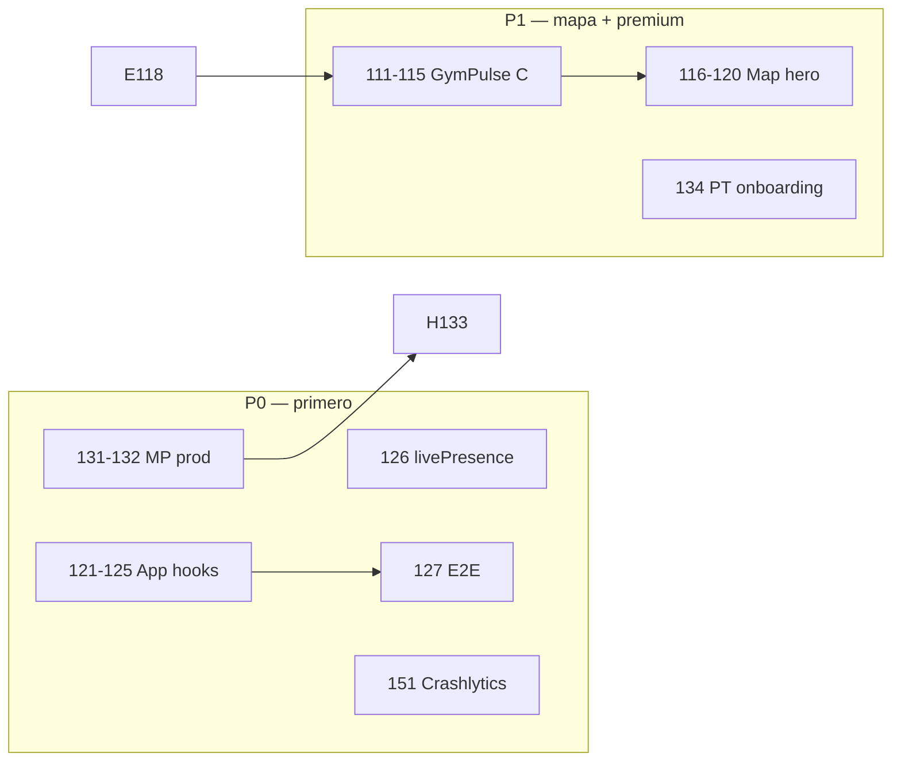

# EntrenaMatch — Roadmap Fases 111–160 (50 fases prioritarias)

**Versión base:** v0.1.235 · **Meta fase 160:** v0.1.280  
**Estado previo:** Fases 1–100 ✅ · GymPulse 101–110 ✅ · **118 ✅ · 111/114/120 🔄**  
**Orden de ataque:** `ORDEN_ATAQUE_111_160.md`  
**Referencia:** `INFORME_REVISION_EXHAUSTIVA_v0.1.230.md`, `ROADMAP_FASES_106_110.md`

---

## Cómo leer este documento

| Prioridad | Significado | Cuándo |
|-----------|-------------|--------|
| **P0** | Rompe confianza, conversión o estabilidad | Ahora — bloquea beta/Play |
| **P1** | Sensación producto premium / retención core | Semanas 1–4 |
| **P2** | Diferenciación y moat social | Semanas 5–8 |
| **P3** | Escala, monetización, ops | Semanas 9–12+ |

Cada fase = **1 entregable verificable** (commit + deploy o test verde).  
Comando versión: `node scripts/bump-version-phase.mjs <N>`

---

## Resumen ejecutivo (orden de ataque)

```
111–115  GymPulse Bloque C (radar, eventos, dispatch, ghost, offline)
116–120  Mapa como producto hero (tab Mapa, tiles vector, métricas)
121–125  Deuda App.tsx — hooks live/fuel/sync/partners
126–130  Confianza: E2E, livePresence única, tipos mapa
131–135  EntrenaCoach + Mercado Pago producción + liquidaciones PT
136–140  FuelBalance + EntrenaLog + wearables
141–145  Social graph: feed, chat, sync polish
146–150  Partners B2B + marketplace real
151–155  Android / Play / Crashlytics / CI
156–160  Escala: analytics, i18n, portal partners, MapLibre GL
```

---

## Bloque D — GymPulse diferenciador (111–115) · P1

| Fase | Entregable | Prioridad | Referencia |
|------|------------|-----------|------------|
| **111** | **Radar mode** — sweep animado + pill “X personas en 2 km” | P1 | Pokémon GO |
| **112** | **City challenge overlay** — zona activa del reto en mapa (polígono + CTA) | P1 | Pokémon GO raids |
| **113** | **PT dispatch pin** — entrenador en ruta hacia cliente (interp + ETA pill) | P2 | Uber |
| **114** | **Ghost mode** — ubicación fuzzy (~500 m) + toggle en Perfil | P0 | Snapchat |
| **115** | **Tiles offline** — cache última bbox vista (IndexedDB + fallback) | P2 | Google Maps |

**Archivos clave:** `GymPulseMap.tsx`, `GymPulseMapShell.tsx`, `gymPulseMapConfig.ts`, `ProfileTab`, `services/cityChallenge.ts`

**Criterio de done 111:** botón radar en mapa → animación 3 s → contador live en radio 2 km actualizado.

---

## Bloque E — Mapa como cara del producto (116–120) · P1

| Fase | Entregable | Prioridad |
|------|------------|-----------|
| **116** | **Tab “Mapa”** dedicado en nav (o hero tab Explorar = mapa first) | P1 |
| **117** | **MapLibre GL / vector dark** — sustituir raster Carto por style URL premium | P1 |
| **118** | **Quitar partners seed demo** en prod — solo Firestore verificados + filtro “cerca” | P0 | ✅ v0.1.234 |
| **119** | **QR check-in partner** — escaneo o deep link `?gym=id` → check-in automático | P1 |
| **120** | **Métricas mapa** — eventos `map_open`, `cluster_expand`, `partner_checkin` (Analytics) | P2 |

**Nota fase 118:** resuelve pins con dirección incorrecta (HUB/seeds). Partners reales solo vía admin/dev verificado.

---

## Bloque F — Refactor App.tsx (121–125) · P0

| Fase | Entregable | Prioridad |
|------|------------|-----------|
| **121** | Extraer **`useLiveMapPipeline`** (liveTrainingNow, filters, mapForceTick) | P0 |
| **122** | Extraer **`useFuelState`** + refreshFuelData fuera de App | P0 |
| **123** | Extraer **`useSyncSession`** (Arena, trainingSyncWith, bonds) | P0 |
| **124** | Extraer **partner dev CRUD** → `usePartnerLocations` + `ExploreLivePanel` only | P1 |
| **125** | **App.tsx < 8k líneas** — meta intermedia; LazyTabs sin imports estáticos rotos | P1 |

**Criterio de done 121:** `App.tsx` no contiene `filterMapLiveUsers` ni debounce mapa inline.

---

## Bloque G — Confianza y calidad (126–130) · P0

| Fase | Entregable | Prioridad |
|------|------------|-----------|
| **126** | **`livePresence` fuente primaria** — profiles.trainingNow solo fallback documentado | P0 |
| **127** | **E2E Playwright:** login → live ON → mapa → sync → EntrenaLog → Fuel | P0 |
| **128** | Quitar **`@ts-nocheck`** de `GymPulseMap.tsx` + tipos estrictos popups | P1 |
| **129** | **Vitest** marker diff + cluster + filterMapLiveUsers (regresión 110) | P1 |
| **130** | **Lighthouse CI** — budget bundle App chunk + map lazy | P2 |

---

## Bloque H — EntrenaCoach + pagos (131–135) · P0

| Fase | Entregable | Prioridad |
|------|------------|-----------|
| **131** | **MP producción** — `APP_USR` token real + webhook prod verificado | P0 |
| **132** | **Checkout marketplace** — cliente paga plataforma, 15% fee, payout PT pending | P0 |
| **133** | **Admin liquidaciones** — marcar pagado + export CSV PT | P1 |
| **134** | **Onboarding PT self-service** — form + video + estado pending/verified | P0 |
| **135** | **PT pin en mapa** — icono distinto + popup reserva rápida | P1 |

**Scripts:** `scripts/setup-mp-production.ps1`, `functions/createTrainerMpCheckout`, `AdminOpsPanel`

---

## Bloque I — FuelBalance + EntrenaLog (136–140) · P1

| Fase | Entregable | Prioridad |
|------|------------|-----------|
| **136** | **Gráfico semanal** burn vs consumo vs target (FuelDayCard extendido) | P1 |
| **137** | **Copiar último entreno** one-tap en EntrenaLog | P1 |
| **138** | **PRs / records** por ejercicio (local + Firestore) | P2 |
| **139** | **Health Connect / Apple Health** — import pasos + burn real (stub → real) | P2 |
| **140** | **Post-EntrenaLog → Fuel** toast inteligente con kcal estimadas del set | P1 |

---

## Bloque J — Social graph y retención (141–145) · P1

| Fase | Entregable | Prioridad |
|------|------------|-----------|
| **141** | **Feed ranking** — proximidad + live + bond strength | P1 |
| **142** | **Share card post-sync** — imagen OG + publicar a muro automático | P2 |
| **143** | **Deep links notificaciones** — tap → chat / sesión / perfil / mapa | P1 |
| **144** | **Chat polish** — read receipts + typing + icebreaker desde mapa popup | P2 |
| **145** | **Training Network** en perfil — grafo visual de alianzas sync | P2 |

---

## Bloque K — Partners B2B + Marketplace (146–150) · P1–P2

| Fase | Entregable | Prioridad |
|------|------------|-----------|
| **146** | **Portal partner gym** (web) — stats check-ins, promos, logo | P2 |
| **147** | **Partner dashboard in-app** — dueño gym ve live count + check-ins día | P1 |
| **148** | **Marketplace catálogo** — 5–10 productos reales merch EntrenaMatch | P1 |
| **149** | **Inventario + stock** — decremento post-orden MP | P2 |
| **150** | **Comisión partner mapa** — CTA promo trackeable + UTM por gym | P2 |

---

## Bloque L — Mobile y distribución (151–155) · P0–P1

| Fase | Entregable | Prioridad |
|------|------------|-----------|
| **151** | **Firebase Crashlytics** — native + JS, test crash en CI | P0 |
| **152** | **AAB Play Closed** — upload + testers S26 matrix documentada | P0 |
| **153** | **Capacitor sync** — build web base `/` + sync mapa offline 115 en APK | P1 |
| **154** | **Push deep link** — notif → tab mapa con `?map=1` | P1 |
| **155** | **ASO** — screenshots mapa 2.0 + “What's new” v0.1.250+ | P2 |

---

## Bloque M — Escala e infraestructura (156–160) · P2–P3

| Fase | Entregable | Prioridad |
|------|------------|-----------|
| **156** | **MapEngine abstraction** — interface Leaflet → MapLibre GL migratable | P2 |
| **157** | **Internacionalización EN** — strings mapa + onboarding + landing sync | P3 |
| **158** | **Cloud Functions v2** — cold start + secrets rotation MP anual | P2 |
| **159** | **Firestore indexes audit** — livePresence, checkIns, marketplace orders | P2 |
| **160** | **Open beta v1.0.280** — roadmap 111–160 cerrado, informe + deploy GH+Firebase | P1 |

---

## Dependencias entre bloques



---

## Sprint sugerido (6 semanas × 1 dev)

| Semana | Fases | Objetivo |
|--------|-------|----------|
| 1 | 118, 114, 126, 128 | Mapa confiable + privacidad + tipos |
| 2 | 111, 112, 119, 120 | Radar + city challenge + QR + analytics |
| 3 | 121, 122, 123, 127 | Refactor hooks + E2E verde |
| 4 | 131, 132, 133, 134 | MP prod + PT onboarding |
| 5 | 116, 117, 135, 136 | Tab mapa + vector tiles + fuel gráfico |
| 6 | 113, 115, 151, 152 | Dispatch + offline + Crashlytics + Play |

---

## Comandos habituales

```powershell
# Versión por fase
node scripts/bump-version-phase.mjs 120

# Build + deploy web (Firebase base /)
npm run deploy

# Tests
npm test
npm run test:e2e

# Functions MP
npm run setup:mp
firebase deploy --only functions --project entrenamatch
```

---

## Documentos relacionados

| Documento | Fases |
|-----------|-------|
| `ROADMAP_FASES_101_105.md` | 101–105 ✅ |
| `ROADMAP_FASES_106_110.md` | 106–110 ✅ |
| **`ROADMAP_FASES_111_160.md`** | **111–160 (este doc)** |
| `INFORME_REVISION_EXHAUSTIVA_v0.1.230.md` | Contexto 101–115 original |
| `ROADMAP_FASES_91_100.md` | Pre-requisito completado |

---

## Próximo paso inmediato recomendado

Ver **`ORDEN_ATAQUE_111_160.md`** — oleada 0–1 en curso: **126** livePresence → **112** city overlay → **121–123** hooks App.

---

*Generado v0.1.235 — consolida informe exhaustivo, bloques C pendientes (111–115), backlog P0–P3 y deuda App.tsx.*
